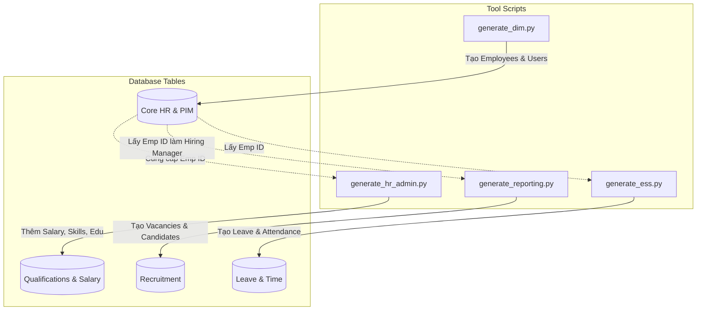

# BÁO CÁO REQUIREMENT 2: DATA GENERATION

## Thông tin cá nhân

| **Thông tin** | **Chi tiết** |
| :--- | :--- |
| **Môn học** | Kiểm thử phần mềm (Software Testing) |
| **Đồ án** | OrangeHRM Case Study |
| **Sinh viên** | Trương Lê Anh Vũ |
| **MSSV** | 22120443 |
| **Nhóm** | 13 |

---

## Thông tin nhóm

| Họ và tên        | MSSV     | Module phụ trách                                            | Feature                                                                                                                                                                                                                                                                                                                                                                                                                                                                                                                                                                                                                                                                                                                                    |
| :--------------- | :------- | :---------------------------------------------------------- | :----------------------------------------------------------------------------------------------------------------------------------------------------------------------------------------------------------------------------------------------------------------------------------------------------------------------------------------------------------------------------------------------------------------------------------------------------------------------------------------------------------------------------------------------------------------------------------------------------------------------------------------------------------------------------------------------------------------------------------------- |
| Nguyễn Đức Toàn  | 22120376 | Leave Management; Recruitment                               | - Sinh dữ liệu loại nghỉ phép, quyền nghỉ phép của nhân viên, đơn xin nghỉ phép, bình luận đơn nghỉ, trạng thái duyệt đơn nghỉ của quản lý. - Sinh dữ liệu vị trí tuyển dụng, ứng viên, hồ sơ ứng tuyển, lịch phỏng vấn, người phỏng vấn, lịch sử tuyển dụng, tài liệu đính kèm. - Thiết kế và thực thi các test case cho chức năng nộp đơn xin nghỉ phép & cấu hình hệ thống nghỉ phép (Leave Types, Entitlements, Approve/Reject workflow). - Thiết kế và thực thi các test case cho quy trình tuyển dụng (Thêm ứng viên, sơ tuyển, phỏng vấn, offer, tuyển dụng, quản lý hồ sơ).                                                                                                                                               |
| Lê Hoàng Việt    | 22120430 | HR Administration; Performance Management                   | - Sinh dữ liệu HR Administration (Organization, Locations, Pay Grades, Skills, Languages, Licenses, Work Shifts, Holidays) và Performance Management (KPIs, Performance Trackers, Tracker Logs, Performance Reviews). - Thiết kế và thực thi test case cho cấu hình HR (Locations, Skills, Pay Grades) và cho Performance (tạo KPI, review, reviewer workflow).                                                                                                                                                                                                                                                                                                                                                                         |
| Lê Thành Vinh    | 22120434 | PIM - Personnel Information Management; Time and Attendance | - Sinh dữ liệu mô tả công việc (Job title), employee status, thông tin nhân viên, thông tin tài khoản người dùng, thông tin báo cáo của nhân viên với quản lý. - Sinh dữ liệu khách hàng, project, hoạt động của project, dữ liệu timesheet của nhân viên, lịch sử tạo, duyệt, từ chối timesheet, dữ liệu chấm công của nhân viên. - Thiết kế và thực thi các test case cho chức năng thêm mới thông tin nhân viên & tài khoản hệ thống cho nhân viên. - Thiết kế và thực thi các test case cho quy trình timesheet (Tạo mới, gửi, duyệt, từ chối chấm công).                                                                                                                                                                     |
| Trương Lê Anh Vũ | 22120443 | Reporting and Analytics; ESS - Employee Self-Service        | Reporting and Analytics: Cung cấp bộ công cụ trích xuất và xuất dữ liệu (Export) đa định dạng: - Báo cáo Hồ sơ Nhân viên: Lọc và xuất danh sách nhân viên theo các tiêu chí mở rộng (Trình độ, Kỹ năng, Lương) phục vụ thống kê. - Báo cáo Quy trình Tuyển dụng: Theo dõi danh sách ứng viên và trạng thái tuyển dụng theo từng người phụ trách (Hiring Manager). - Báo cáo Tổng hợp Time & Leave: Truy xuất lịch sử sử dụng phép và bảng công đã được duyệt (Approved) để phục vụ mục đích báo cáo dự án.  Employee Self-Service (ESS): Tính năng tương tác trực tiếp dành cho người lao động: - Tra cứu thông tin: Nhân viên tự truy cập để kiểm tra hồ sơ cá nhân (My Info) và hạn mức phép năm (Leave Entitlements). |

---

## 1. Giới thiệu công cụ (Tool Overview)

Để tạo dữ liệu kiểm thử (Test Data) có ý nghĩa (**meaningful**) và nhất quán cho các chức năng **Reporting & Analytics** và **Employee Self-Service (ESS)**, tôi đã phát triển bộ công cụ tự động bằng ngôn ngữ lập trình **Python**.

Công cụ sử dụng các thư viện chính:
* `Faker`: Sinh dữ liệu giả lập chuẩn xác (tên, địa chỉ, email, số điện thoại...).
* `mysql-connector`: Tương tác trực tiếp với cơ sở dữ liệu MySQL của OrangeHRM để nạp dữ liệu (Bulk Insert).

---

## 2. Danh mục dữ liệu và phạm vi ngẫu nhiên (Data Categories & Ranges)

Dữ liệu được sinh ra tập trung vào các nhóm sau để phục vụ **Requirement 3 (Functional Testing)**:

### 2.1. Dữ liệu nhân sự nòng cốt (Core HR & PIM)
* **Số lượng:** 50 nhân viên (Employee IDs từ `1000` đến `1049`).
* **Chức danh (Job Titles):** Phân bổ theo cấu trúc hình tháp:
    * 1 Director
    * ~4 Managers
    * ~45 Staff
* **Thông tin cá nhân:** Họ tên tiếng Việt, Giới tính ngẫu nhiên, Ngày gia nhập (Joined Date) trong vòng 5 năm gần nhất.
* **Tài khoản (Users):** Mỗi nhân viên có 1 tài khoản đăng nhập (Username tự sinh, Password mặc định: `OrangeHRM@111`).

### 2.2. Dữ liệu trình độ & Lương (Qualifications & Salary)
Dữ liệu này phục vụ cho việc kiểm tra các bộ lọc báo cáo (Filtering Options) trong module Reporting:
* **Kỹ năng (Skills):** Random từ tập hợp `[Java, Python, Testing, Selenium, Project Management]`.
* **Học vấn (Education):** Bachelor, Master, PhD, High School.
* **Lương (Salary):** Random từ **15,000,000** đến **50,000,000 VND** (được gắn với Pay Grade).
* **Địa điểm (Locations):** Head Office HCM, Hanoi Branch, Da Nang Tech Hub.

### 2.3. Dữ liệu Tuyển dụng (Recruitment)
* **Vị trí tuyển dụng (Vacancies):** Được liên kết với Job Title có sẵn. Đặc biệt: **Gán ngẫu nhiên Hiring Manager** (là các nhân viên hiện có trong hệ thống).
* **Ứng viên (Candidates):** 30 hồ sơ ứng viên.
* **Ngày nộp đơn:** Ngẫu nhiên trong 3 tháng gần nhất.

### 2.4. Dữ liệu ESS (Leave & Time)
* **Quỹ phép (Leave Entitlements):** Cấp mặc định **12 ngày** phép thường niên (Annual Leave) cho nhân viên để hiển thị số dư (Balance).
* **Đơn nghỉ phép (Leave Requests):**
    * Số lượng: Random 0-3 đơn/nhân viên.
    * Thời gian: 6 tháng gần nhất.
    * Trạng thái: `Pending`, `Scheduled`, `Rejected`.
* **Chấm công (Attendance):**
    * Dữ liệu Check-in/Check-out trong 14 ngày làm việc gần nhất.
    * Giờ vào: 08:00 (±30p).
    * Giờ ra: 17:30 (±30p).

---

## 3. Minh chứng hoạt động của công cụ (Tool Operation Screenshots)

Dưới đây là hình ảnh Terminal sau khi chạy script `main.py` (hoặc chạy lần lượt 4 scripts), cho thấy quá trình sinh dữ liệu hoàn tất không có lỗi và file báo cáo được xuất ra folder `exports`.

> **Hình 3.1:** Kết quả chạy tool trên Terminal.

> **Hình 3.2:** Các file CSV báo cáo được xuất ra thành công.

---

## 4. Giải thích mã nguồn (Source Code Explanation)

Bộ công cụ bao gồm 4 scripts chạy theo thứ tự phụ thuộc lẫn nhau để đảm bảo tính toàn vẹn dữ liệu.

### 4.1. Sơ đồ luồng dữ liệu (Data Flow Diagram)

Biểu đồ dưới đây mô tả cách các script tương tác với nhau và tác động lên các bảng trong cơ sở dữ liệu:

### 4.2. Chi tiết các script

#### a. `generate_dim.py` (Core Data)
* **Chức năng:** Tạo dữ liệu khung sườn (Master Data) cho hệ thống.
* **Logic xử lý:**
    1.  Kết nối Database và tắt kiểm tra khóa ngoại (`FOREIGN_KEY_CHECKS = 0`) để tối ưu tốc độ nạp dữ liệu.
    2.  Khởi tạo các danh mục cơ bản: `Job Titles` (Chức danh) và `Employment Status` (Trạng thái việc làm).
    3.  **Vòng lặp sinh nhân viên:** Tạo 50 hồ sơ nhân viên sử dụng thư viện `Faker`. Logic phân chia vai trò (Role) được xác định dựa trên số thứ tự (Index):
        * Index 0: Director.
        * Index 1-4: Managers.
        * Index 5-49: Staff.
    4.  Tạo **User Login** tương ứng cho từng nhân viên để phục vụ đăng nhập.
    5.  Thiết lập cấu trúc báo cáo (Reporting Line): Staff báo cáo cho Manager, Manager báo cáo cho Director.

#### b. `generate_hr_admin.py` (Admin & Qualifications)
* **Chức năng:** Làm giàu hồ sơ nhân viên với các thông tin trình độ để phục vụ bộ lọc báo cáo (Report Filters).
* **Logic xử lý:**
    1.  Khởi tạo các danh mục trình độ: *Skills (Kỹ năng), Education (Học vấn), Licenses (Chứng chỉ), Languages (Ngôn ngữ), Pay Grades (Ngạch lương)*.
    2.  **Gán dữ liệu:** Duyệt qua danh sách nhân viên và gán ngẫu nhiên các thuộc tính trên.
    3.  **Quan trọng:** Thêm dữ liệu **Lương cơ bản (Basic Salary)** vào bảng `hs_hr_emp_basicsalary`, đây là trường dữ liệu quan trọng cho các báo cáo về chi phí nhân sự.

#### c. `generate_reporting.py` (Recruitment)
* **Chức năng:** Tạo dữ liệu giao dịch cho module Tuyển dụng (Recruitment).
* **Logic xử lý:**
    1.  Lấy danh sách ID nhân viên hiện có trong hệ thống để chọn ngẫu nhiên làm **Hiring Manager** (Người quản lý tuyển dụng).
    2.  Tạo các vị trí tuyển dụng (`Job Vacancy`) liên kết với Job Title và Hiring Manager tương ứng.
    3.  Tạo 30 hồ sơ ứng viên (`Candidates`) và liên kết họ với các vị trí tuyển dụng này.
    4.  Xuất file CSV `reporting_candidates.csv` chứa thông tin ứng viên để đối chiếu kết quả khi kiểm thử.

#### d. `generate_ess.py` (Leave & Time)
* **Chức năng:** Tạo dữ liệu giao dịch cho phân hệ Employee Self-Service (ESS).
* **Logic xử lý:**
    1.  **Leave (Nghỉ phép):**
        * Kiểm tra và cấp quỹ phép (Entitlements): 12 ngày phép thường niên (Annual Leave) để đảm bảo số dư khả dụng > 0.
        * Tạo đơn xin nghỉ phép (Requests) với các trạng thái khác nhau (Pending, Scheduled).
    2.  **Time (Thời gian & Chấm công):**
        * Tạo dữ liệu chấm công (Attendance) mô phỏng giờ vào/ra trong 14 ngày gần nhất.
        * Tạo bảng công (Timesheets) với trạng thái `SUBMITTED` để phục vụ kịch bản duyệt bảng công của quản lý.

## 5. Hình ảnh dữ liệu mẫu trên hệ thống (Sample Data Screenshots)

Sau khi chạy tool, dữ liệu đã hiển thị chính xác trên giao diện OrangeHRM, chứng minh các chức năng hoạt động đúng như mong đợi.

### 5.1. Dữ liệu Tuyển dụng (Recruitment Data)
Hình ảnh hiển thị danh sách các vị trí tuyển dụng (Vacancies) đã được tạo tự động và gán cho các Hiring Manager cụ thể.

> **Hình 5.1:** Danh sách vị trí tuyển dụng được sinh tự động.

### 5.2. Thông tin trình độ nhân viên (Employee Qualifications)
Hình ảnh hồ sơ nhân viên hiển thị đầy đủ các thông tin bổ sung như Kỹ năng, Học vấn, Giấy phép và Ngôn ngữ.

> **Hình 5.2:** Hồ sơ trình độ (Qualifications) của nhân viên đã được làm giàu dữ liệu.

### 5.3. Số dư phép và Đơn nghỉ (Leave Balance & Requests)
Hình ảnh hiển thị danh sách đơn nghỉ phép (Leave List) với trạng thái "Pending Approval" và số dư phép (Entitlements) của nhân viên.

> **Hình 5.3:** Danh sách đơn nghỉ phép chờ duyệt và số dư phép năm.

### 5.4. Bảng công và Chấm công (Time & Timesheets)
Hình ảnh hiển thị danh sách các bảng công (Timesheets) của nhân viên đã được tạo tự động với trạng thái **"Submitted"** (Đã nộp). Do tài khoản Admin đã được gán làm Quản lý trực tiếp (Supervisor), các bảng công này xuất hiện trong danh sách **"Timesheets Pending Action"** để chờ phê duyệt.

> **Hình 5.4:** Danh sách bảng công nhân viên đang chờ duyệt (Pending Action).

### 5.5. Employee Self-Service (ESS) - Kiểm chứng góc nhìn nhân viên
Để đáp ứng yêu cầu về ESS ("Employee access to personal profiles..."), tôi đã đăng nhập bằng tài khoản của một nhân viên ngẫu nhiên được sinh ra bởi công cụ (User: `username_nhan_vien` / Pass: `OrangeHRM@111`) để xác thực dữ liệu.

**a. Truy cập Hồ sơ cá nhân (My Info)**
Nhân viên có quyền truy cập vào module **My Info** để xem thông tin cá nhân, liên hệ và công việc của chính mình mà không cần quyền Admin.

> **Hình 5.5:** Giao diện My Info hiển thị thông tin cá nhân của nhân viên đang đăng nhập.

**b. Theo dõi Nghỉ phép (My Leave & Entitlements)**
Tại màn hình **My Leave**, nhân viên có thể xem lịch sử các đơn nghỉ phép đã nộp (được sinh tự động bởi script `generate_ess.py`) cùng với trạng thái phê duyệt (Pending/Scheduled).

> **Hình 5.6:** Lịch sử đơn nghỉ phép và trạng thái xử lý dưới góc nhìn nhân viên.

**c. Quản lý Bảng công (My Timesheets)**
Nhân viên truy cập **My Timesheets** để xem bảng công tuần hiện tại hoặc các tuần trước đó. Dữ liệu hiển thị khớp với những gì script đã tạo ra (Trạng thái: Submitted).

> **Hình 5.7:** Bảng công cá nhân của nhân viên.

---

## 6. Tổng kết Cơ sở dữ liệu (Database Schema Summary)

Bộ công cụ đã tác động và làm giàu dữ liệu cho các bảng quan trọng sau trong cơ sở dữ liệu OrangeHRM:

### Nhóm 1: PIM & Core HR (Quản lý nhân sự)
| Tên bảng | Các trường chính (Columns) | Mô tả |
| :--- | :--- | :--- |
| `hs_hr_employee` | `emp_number`, `employee_id`, `emp_firstname`, `emp_lastname` | Thông tin cơ bản nhân viên (Tên, Mã NV). |
| `ohrm_user` | `id`, `user_name`, `user_password`, `emp_number` | Tài khoản đăng nhập hệ thống. |
| `hs_hr_emp_reportto` | `erep_sup_emp_number`, `erep_sub_emp_number` | Cấu trúc báo cáo (Supervisor - Subordinate). |

### Nhóm 2: Qualifications & Salary (Trình độ & Lương)
| Tên bảng | Các trường chính (Columns) | Mô tả |
| :--- | :--- | :--- |
| `ohrm_skill` / `hs_hr_emp_skill` | `skill_id`, `emp_number`, `years_of_exp` | Danh mục Kỹ năng & Kỹ năng của nhân viên. |
| `ohrm_emp_education` | `education_id`, `emp_number`, `major` | Trình độ học vấn của nhân viên. |
| `hs_hr_emp_basicsalary`| `emp_number`, `ebsal_basic_salary`, `sal_grd_code` | **Lương cơ bản** (Trường quan trọng cho Báo cáo). |

### Nhóm 3: Recruitment (Tuyển dụng)
| Tên bảng | Các trường chính (Columns) | Mô tả |
| :--- | :--- | :--- |
| `ohrm_job_vacancy` | `id`, `name`, `job_title_code`, `hiring_manager_id` | Vị trí tuyển dụng (Gắn với Hiring Manager). |
| `ohrm_job_candidate` | `id`, `first_name`, `last_name`, `email`, `status` | Hồ sơ ứng viên tuyển dụng. |

### Nhóm 4: ESS - Leave & Time (Nghỉ phép & Chấm công)
| Tên bảng | Các trường chính (Columns) | Mô tả |
| :--- | :--- | :--- |
| `ohrm_leave_entitlement`| `id`, `emp_number`, `no_of_days`, `entitlement_type` | **Quỹ phép năm** (Tạo số dư Balance). |
| `ohrm_leave_request` | `id`, `leave_type_id`, `date_applied`, `emp_number` | Đơn xin nghỉ (Thông tin chung). |
| `ohrm_leave` | `id`, `date`, `length_days`, `status` | Chi tiết từng ngày nghỉ. |
| `ohrm_timesheet` | `timesheet_id`, `state`, `start_date`, `end_date` | Bảng công tuần (Header). |
| `ohrm_timesheet_item` | `timesheet_id`, `date`, `duration`, `project_id` | Chi tiết giờ làm việc hàng ngày. |